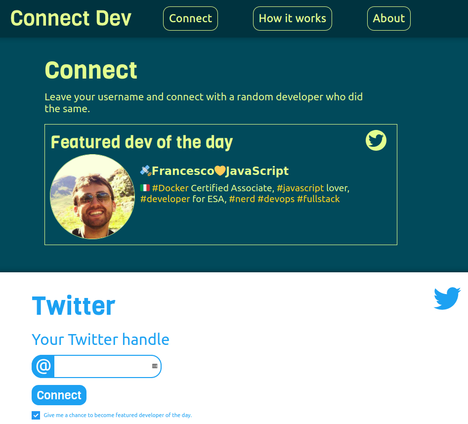

# Connect Dev
This is the front-end for the website [Connect Dev](http://connectdev.me/). It’s a website that lets you connect with a random developer and check out their Twitter/GitHub.
The site is made with React, and the backend is made with Express and Mongodb. 

## Contributing
This is my first React project and I properly didn't do a perfect job, so if you think you can improve something, create a pull request and I will review it. Thank you in advance.

## License
This project is licensed under the MIT License - see the [LICENSE](LICENSE) file for details
